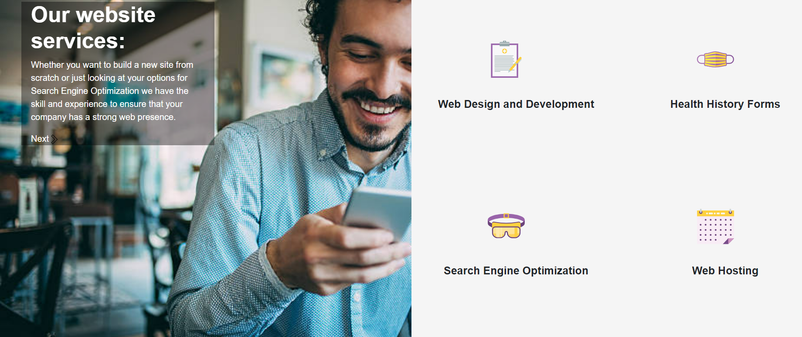
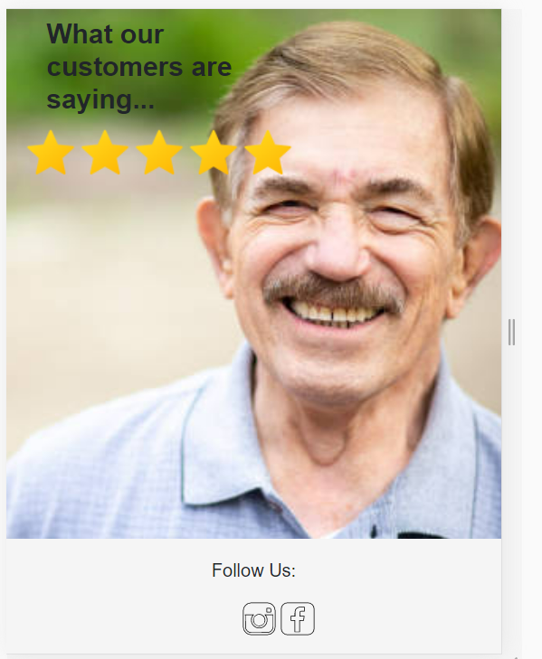

# Rooster Grin Marketing Site

This site is designed for submission to the Rooster Grin Front-end Developer Test. This site is designed to demonstrate key skills used in front-end applications including mobile responsiveness, animation, and orderly coding practices.


## Usage:

To run locally, clone the repo, then run:

```
npm install
```

This will install the dependencies needed to run the app locally. When that is complete you can run the command:

```
npm start
```

Your app should now be running on <http://localhost:3000>.



### Notes:

Future versions of this code will be deployed on heroku and the link will be provided.

## Assignment Notes:

1. Technology: I chose React.js because my familiarity with the library would make it easier to develop the project within the time frame established by the client. I used react-bootstrap to help with styling as it is very reliable and easy to manipulate.
2. Challenges: The biggest challenge with this project was to not get overinvolved with the project...I had so much fun putting it together that I found it hard to pull away! On the technical side I REALLY enjoyed hunting for just the right dependencies to accomplish a few of the features, but it was also a challenge-there are a LOT of potential tools out there and many of them do a fantastic job!
3. Noteworthy: The most enjoyable part of this project was keeping the code organized and modularized.


